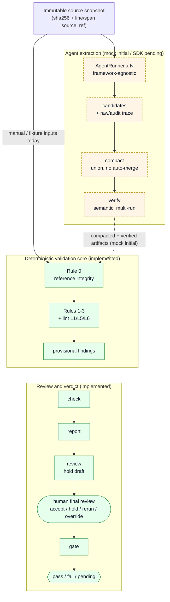

<!-- .ko mirror created on finalize (publication_plan §7b) -->

<p align="center">
  <a href="./README.md"></a>
  <a href="./README.ko.md"></a>
</p>
<p align="center"><sub>Switch language / 언어 전환</sub></p>

# Assessment Spec Harness PoC

> CI for hiring assessments — a harness that detects, in advance, mismatches between a hiring assignment's public spec and its private grading rubric.

This tool does not evaluate the candidate. **It evaluates the assessment design itself.**

---

## What this proves today

This PoC finds the design risks between a public `spec.md` and a private
`rubric.md` through a deterministic harness workflow.

- `examples/deskhive_assignment`: in a complex maintenance/bugfix assignment, it
  reproduces optional items scored as core, must items covered by bonus only,
  double scoring, and more.
- `examples/pulse_assignment`: in a Go greenfield CLI assignment, it reproduces
  a rubric requirement that contradicts the spec, over-weighted optional
  windowing, bonus items absent from the spec, and more.
- Both examples reproduced the same finding distribution across three repeated
  runs, and Rule 0 reference integrity diagnostics were 0.

The detailed repeated-run results and limitations are collected in the
[PoC results report](report.md). One important caveat: these results validate
the `deterministic_extraction` + mock semantic verification path; they are not
yet a quality validation of a live LLM SDK runner.

---

## Primary user: AI agents

The primary caller of this tool is an AI agent such as Claude Code, Codex, or Gemini. The CLI contract, exit codes, and output formats are all designed to be agent-consumable. Humans participate only as final reviewers.

Direct human CLI invocation also works (a secondary usage path).

---

## Quick start

### 0. Install (PoC stage: local development)

```bash
git clone <repo>
cd assessment_poc
pip install -e .
```

### 1. Check the current contract (recommended first step for a caller agent)

```bash
assessment-harness schema --command check --output json
```

Use schema introspection every time to confirm the stable core / informational fields / exit codes / next_actions types. Safe integration is possible without keeping up with the docs.

### 2. See the example PoC results

For the latest example repeated-validation summary, start with the root
[report.md](report.md). This report collects the results of running
`examples/deskhive_assignment` and `examples/pulse_assignment` end-to-end three
times each.

The example outputs are generated under the gitignored
`work/poc_report_runs/run{1,2,3}/...`. To re-run them yourself, swap the
`extract` inputs of the full flow below for the example files.

```bash
PYTHONPATH=src python3 -m assessment_harness.cli extract \
  --spec examples/deskhive_assignment/spec.md \
  --rubric examples/deskhive_assignment/rubric.md \
  --runner deterministic_extraction \
  --runs 3 \
  --policy config/policy.yaml \
  --out-dir work/deskhive_run/runs
```

### 3. Deterministic validation only (Phase 0)

Run Rule 0–3 checks over manually authored compacted YAML inputs.

```bash
assessment-harness check \
  --spec-items fixtures/clean_assignment/spec_items.yaml \
  --rubric-items fixtures/clean_assignment/rubric_items.yaml \
  --trace-links fixtures/clean_assignment/trace_links.yaml \
  --source-manifest fixtures/clean_assignment/source_manifest.yaml \
  --policy config/policy.yaml \
  --out findings.json \
  --diagnostics-out integrity_diagnostics.json \
  --review-queue-out review_queue.json

assessment-harness report \
  --findings findings.json \
  --diagnostics integrity_diagnostics.json \
  --out work/report.md
```

`--source-manifest` is a required input for Phase 0 `check` (plan §5.0 / §5.1 / §11). Omitting it returns `status=invalid_input`, exit `2`, diagnostic `source_manifest_required`, and next_action `provide_source_manifest`.

`--policy` is also required. If `rules.optionality_mismatch.weight_threshold` is absent, the Rule 3 boundary is not silently skipped; instead it returns `status=invalid_input`, exit `2`, with a recovery instruction.

In Phase 0, with no semantic verification input, `ai_judgement` links stay in a pending-semantic state. In an agent execution flow, you pass the `verify` outputs below to subsequent commands.

The Rule L1/L6 lint safeguard is also recorded in `review_queue.json` by Phase 0 `check`.
If `--review-queue-out` is omitted, it is created next to `--out`; on a Rule 0
clean run with no findings, it is updated to an empty queue so no stale review
items remain.
Phase 0 `check` output is for the lint safeguard only. Phase 2 `compact` can
preserve an existing queue via `--review-queue-in` and append invalid-run
entries. Phase 2 `verify` also preserves an existing queue via `--review-queue-in`
and appends `ai_judgement_pending` entries without duplicates. `check`
`--review-queue-out` is still a standalone lint-safeguard output, so it is not
written directly into the existing unified queue path.

After the final review is recorded in `final_review.yaml`, `gate` issues the
external verdict. A finding decision in the final review points to a finding by
`type` + generated identifiers (`rubric_id`, `spec_id`, paired rubric IDs) only,
and does not copy any `message` or `evidence` payload.

```bash
assessment-harness gate \
  --final-review final_review.yaml \
  --output json
```

### 4. Full flow including agent execution (Phase 2/3, partially implemented)

> ⚠️ In the full flow below, the `extract` / `compact` / `verify` CLIs are
> implemented only for the initial `mock_fixture` path. The real SDK runner is
> not implemented yet. Currently `extract` replays a fixture to produce per-run
> `candidates.yaml` and raw/audit traces, and `compact` reads per-run
> `candidates.yaml` under `--runs-dir`, or takes a list of `--candidates` files
> as a low-level input, to produce canonical YAML.
> `verify` records the `ai_judgement` evidence of compacted trace links into a
> separate `semantic_verifications.yaml` and review queue entries, but does not
> modify the compacted links or finalize a semantic judgment. When `id_map.yaml`
> is present, the trace link canonical ID is taken from id_map lineage rather
> than file order. `check` does not write these proposals to the original links;
> it reflects them only as an in-memory effective `semantic_status`. When passing
> `--semantic-verifications` for a trace with compacting lineage, you must also
> pass `--id-map`, so that `check` applies the proposals on the same lineage
> basis as `verify`.

```bash
# multiple independent runs
assessment-harness extract \
  --spec fixtures/clean_assignment/source/spec.md \
  --rubric fixtures/clean_assignment/source/rubric.md \
  --runner mock_fixture \
  --fixture-dir fixtures/clean_assignment \
  --runs 3 \
  --out-dir work/runs

# compacting (no auto-acceptance; support/identity_basis/variants preserved)
assessment-harness compact \
  --runs-dir work/runs \
  --policy config/policy.yaml \
  --out-dir work/compacted

# multiple semantic verification agent runs (source/links read-only, proposals stored separately)
assessment-harness verify \
  --compacted-dir work/compacted \
  --source-manifest work/source_snapshot/manifest.yaml \
  --runner mock_fixture \
  --runs 3 \
  --policy config/policy.yaml \
  --out-dir work/semantic_verification

# deterministic check (produces provisional findings)
assessment-harness check \
  --spec-items work/compacted/spec_items.yaml \
  --rubric-items work/compacted/rubric_items.yaml \
  --trace-links work/compacted/trace_links.yaml \
  --source-manifest work/source_snapshot/manifest.yaml \
  --semantic-verifications work/semantic_verification/semantic_verifications.yaml \
  --id-map work/compacted/id_map.yaml \
  --policy config/policy.yaml \
  --out work/findings.json \
  --diagnostics-out work/integrity_diagnostics.json

# human-facing report
assessment-harness report \
  --findings work/findings.json \
  --diagnostics work/integrity_diagnostics.json \
  --semantic-verifications work/semantic_verification/semantic_verifications.yaml \
  --review-queue work/compacted/review_queue.json \
  --out work/report.md

# browser-viewable HTML report
assessment-harness report \
  --findings work/findings.json \
  --diagnostics work/integrity_diagnostics.json \
  --policy config/policy.yaml \
  --semantic-verifications work/semantic_verification/semantic_verifications.yaml \
  --review-queue work/compacted/review_queue.json \
  --format html \
  --out work/report.html

# record the final human review
assessment-harness review \
  --compacted-dir work/compacted \
  --findings work/findings.json \
  --diagnostics work/integrity_diagnostics.json \
  --semantic-verifications work/semantic_verification/semantic_verifications.yaml \
  --review-queue work/compacted/review_queue.json \
  --report work/report.md \
  --reviewer kdt \
  --out-dir work/final_review

# external verdict after final review
assessment-harness gate \
  --final-review work/final_review/review.yaml \
  --output json
```

---

## Flow overview (architecture)

The whole pipeline is anchored to an **immutable source snapshot** (sha256 +
line/span `source_ref`). The deterministic validation core and the
review/verdict flow are **implemented**; the multi-run agent extraction pipeline
that feeds them is at the **contract/foundation** stage. The diagram below marks
that boundary directly — the solid line into Rule 0 is the *current* input path
(manual/fixture), and the dashed line is the agent path *when implemented*.



---

## Core data contracts

For detailed schemas, see [Implementation Plan §5](docs/planning/implementation_plan_assessment_harness_poc_v1.ko.md#5-데이터-계약). The implementation plan is still Korean-source at v1.32; its full English mirror is pending. Summary:

- **spec_items / rubric_items / trace_links**: compacted artifacts. `support` (which runs found it), `identity_basis` (the basis for sameness), `variants` (minor differences preserved)
- **candidate artifacts**: per-run pre-compacting candidates. `classify_candidate_run_integrity` checks only schema/audit-trace attribution and marks runs as `structurally_validated`; `classify_deep_candidate_run_integrity` distinguishes internal reference, source grounding, and token-quote mismatch, promoting only passing runs to `validated`.
- **source_manifest / source_ref**: immutable input snapshot hash and line/span anchors. Source grounding can be verified without a DB/RAG.
- **id_map**: provenance for remapping run-local IDs to compacted canonical IDs. An extension point for later project/version management.
- **trace_links.evidence_quotes**: branched by `verification_mode`
  - `token_sequence`: strict substring matching (quantitative-marker verification)
  - `ai_judgement` (default): reference integrity only; meaning is confirmed by read-only verifier-agent proposals and a final human review
- **semantic_verifications.yaml**: aggregates `supported` / `rejected` / `uncertain` proposals across multiple verifier-agent runs. It does not modify compacted links; `check` uses it only as the effective status of Rule 1 evidence. When passing `--semantic-verifications` for a trace with compacting lineage, you must also pass `--id-map`, so proposals are joined by canonical lineage rather than trace order
- **verify mock path**: for `ai_judgement` evidence it leaves a conservative `agent_uncertain` proposal. When a quote-level `source_ref` is missing, it surfaces the uncertainty as `source_refs: []` and also records it in the review queue
- **integrity_diagnostics.json**: records Rule 0 violations
- **review_queue.json**: the five existing review entry types plus the lint-safeguard `double_scoring_review` / `mandatory_spec_bonus_review`. In Phase 0, Rule L1/L6 each create a paired queue entry, while Rule L5 creates only a finding/action
- **findings.json**: Rule 1–3 violations (Rule 0 is a separate diagnostic)
- **final_review/**: the final reviewer's accept/hold/rerun/override record. The `review` command accepts only findings with `status=success`/`provisional_findings`, and produces a draft `review.yaml` that leaves every finding as `hold`; a human edits it into final decisions. An existing draft is not overwritten by default; intentional regeneration uses `--force`. A finding decision closes a `findings.json` entry with a minimal `target_key`
- **gate output**: the pass/fail/pending verdict consumed by an external caller after the final review. Exit `1` only when there is a confirmed blocking finding

---

## Policy file

All policy is unified into a single `config/policy.yaml`. Phase 0 `check`
requires at minimum `rules.optionality_mismatch.weight_threshold`.

```yaml
rules:
  optionality_mismatch:
    weight_threshold: 10
compacting:
  identity_basis:
    spec_item: "source+section+normalized_text"
    rubric_item: "title+normalized_description"
    trace_link: "rubric_id+sorted(spec_ids)"
runs:
  min_valid_runs: 2
  default_runs: 3
  max_runs: 7
verification:
  default_mode: ai_judgement
```

The CLI receives all policy through the single `--policy config/policy.yaml`.

---

## CLI output contract (agent-consumable)

Every command supports machine-readable output via the `--output json` flag.

### Exit codes

| Code | Meaning |
|---|---|
| 0 | success/provisional/pending; no final blocking verdict |
| 1 | a confirmed blocking finding exists in `gate` |
| 2 | input/integrity error (including Rule 0 violations) |
| 3 | internal error (runner failure, etc.) |

### Stable core (required for every command)

- `status`: `success` / `provisional_findings` / `pending_review` / `fail` / `invalid_input` / `internal_error`
- `exit_code`: 0/1/2/3
- `command`: the name of the executed command
- `next_actions`: array of hints for the caller agent (empty array if none)

All other fields are informational and may change without prior notice. The caller agent is recommended to **always confirm the current contract via the `schema` command**.

---

## Implementation status

| Area | Status |
|---|---|
| Phase 0 deterministic validation core (Rule 0–3 + lint L1/L5/L6, fixture regression) | Complete |
| review / gate finding-level flow | Initial implementation complete |
| AgentRunner protocol | Foundation complete |
| Candidate artifact schema | Foundation complete |
| Candidate audit-trace attribution | Foundation complete |
| Runner artifact normalization | Foundation complete |
| Candidate integrity classification (structural + staged model) | Foundation complete |
| Deep candidate Rule 0 verification helper (3-way isolation) | Foundation complete |
| `extract` CLI orchestration (`mock_fixture`) | Initial implementation complete |
| `compact` CLI orchestration | Initial implementation complete |
| `verify` orchestration (`mock_fixture`) | Initial implementation complete |
| `materialize-review` CLI orchestration | Initial implementation complete |
| in-repo examples repeated validation (`deterministic_extraction` + mock verifier) | Complete, [report.md](report.md) |
| real SDK runner | Not implemented |
| live LLM-based Phase 2/3 E2E workflow | Not implemented |

> Progress was not a linear sequence of phases. The Phase 2 foundation (runner /
> candidate family) landed first, and the deterministic example workflow works,
> but live extraction backed by a real SDK runner is not there yet. That is why
> status is shown by area rather than by phase number.

Detailed entry conditions / completion criteria: [Implementation Plan §9, §12](docs/planning/implementation_plan_assessment_harness_poc_v1.ko.md#9-단계별-구현-계획)

---

## Documentation Map

A map of which document to read for which purpose.

**If you want to understand this project (3–5 min)**

| Document | Role |
|---|---|
| [docs/case_study.md](docs/case_study.md) | **Start here** — the narrative of problem / goal / key decisions / what I built / verification / limitations |
| [report.md](report.md) | Latest PoC example repeated-validation results — DeskHive/Pulse 3 runs, finding distribution, limitations |
| [docs/decisions.md](docs/decisions.md) | Why it is designed this way — a collection of decision vignettes citing contemporaneous sources |
| [docs/evaluation.md](docs/evaluation.md) | Measured test/smoke evidence (a dated moving snapshot) |
| [docs/audit_index.md](docs/audit_index.md) | A curated index of work logs + independent verification records |

**Spec and design (canonical)**

| Document | Role |
|---|---|
| [docs/planning/implementation_plan_assessment_harness_poc_v1.ko.md](docs/planning/implementation_plan_assessment_harness_poc_v1.ko.md) | **Implementation spec (1st-priority SoT)** — currently v1.32; Korean source, full English mirror pending |
| [docs/planning/ideation_assessment_harness_v2.2.md](docs/planning/ideation_assessment_harness_v2.2.md) | Rubric Lint Rules family (2nd priority, 2026-05-27 final + in-place revision) |
| [docs/planning/ideation_assessment_harness_v2.1.md](docs/planning/ideation_assessment_harness_v2.1.md) | Product purpose and long-term direction (3rd priority) |
| [docs/planning/ideation_assessment_harness_v2.md](docs/planning/ideation_assessment_harness_v2.md) · [v1](docs/planning/ideation_assessment_harness_v1.md) | historical reference |
| [docs/planning/publication_plan_v1.md](docs/planning/publication_plan_v1.md) | The plan for this public-release effort itself (meta-process) |
| [schemas/](schemas/) | JSON Schema data contracts |
| [docs/guidelines/sdk_runner_decisions.md](docs/guidelines/sdk_runner_decisions.md) | The credential / sample / trace-retention checklist to decide before implementing the real SDK runner |
| [docs/guidelines/sample_assignment_guidelines.md](docs/guidelines/sample_assignment_guidelines.md) | Authoring guide for an AI to create a PoC test-assignment spec/rubric sample |

**Detailed records (audit trail)**

| Document | Role |
|---|---|
| [docs/verifications/](docs/verifications/) | Independent per-slice verification records (assets) |
| [docs/daily_logs/](docs/daily_logs/) | Contemporaneous work logs |
| [CHANGELOG.md](CHANGELOG.md) | Major milestones |

**For agents / contributors (operations)**

| Document | Role |
|---|---|
| [HANDOFF.md](HANDOFF.md) | Current-state snapshot for the next worker |
| [AGENTS.md](AGENTS.md) / [CLAUDE.md](CLAUDE.md) | Coding-agent behavioral guidelines |

---

## Non-scope (to avoid misunderstanding)

This tool does not do the following.

- Auto-grade candidate submissions
- Decide pass/fail
- Notify candidates of evaluation results
- Make legal fairness judgments
- Replace evaluators

These areas either cannot be handled by automation, or are outside the problem scope this PoC addresses.
